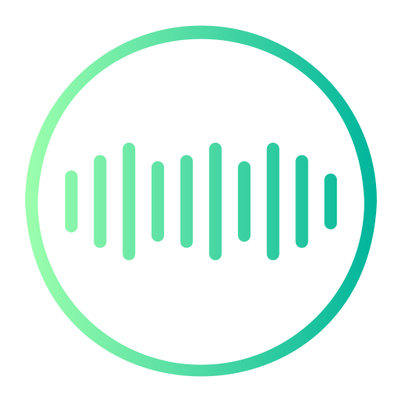
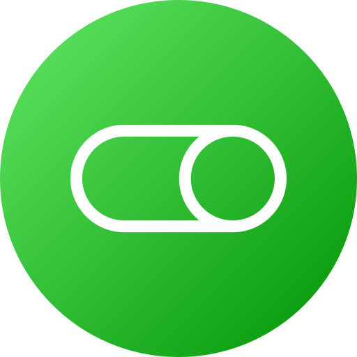

# SignSynth: 3D Speech-to-Sign Language Translator

SignSynth is a real-time application that converts spoken Englishinto American Sign Language (ASL) gloss and animates a 3D avatar to perform the corresponding signs.

Built with Panda3D, VOSK (Offline Speech Recognition), and NLTK.

### Features

- Real-time Speech Recognition: Uses VOSK for offline, low-latency speech-to-text.
- NLP Gloss Conversion: Converts natural English sentences into ASL Gloss structure using NLTK (Lemmatization & Part-of-Speech tagging).
- 3D Animation: Procedural animation system for arms and fingers using Panda3D.
- Media Control: Optional overlay to pause/play external media via simulated spacebar presses while signing.
- Configurable UI: Adjust sign speed, change audio devices.

### Prerequisites

- Ensure you have Python 3.8+ installed.
- Required Python Packages

Note: pypiwin32 is required for media controls on Windows.

## VOSK Model

You must download a compatible VOSK model to run speech recognition.
Download vosk-model-small-en-us-0.15 (or a larger model) from VOSK Models.

Extract the folder into your project root.
Ensure the folder is named exactly: vosk-model-small-en-us-0.15.

📂 Project Structure
<pre>
SignSynth/
├── main.py                  # Entry point & panda3D Engine logic
├── speech_gloss.py          # Audio processing & VOSK integration
├── sign_language_app.py          # UI for app
├── sign_poses.json          # Database of sign pose definitions
├── vosk-model-small-en-us-0.15/  # Speech recognition model
├── assets/
│   └── icons/               # UI Icons 
├── character/               # 3D Models
│   ├── body.bam
│   ├── LArm.bam
│   └── RArm.bam
└── skybox/               
</pre>

### Controls & UI

#### Buttons / Controls

| Icon | Control | Function |
|------|---------|----------|
|  | **Mic Toggle** | Turns speech recognition **On/Off**. |
|  | **Media Control Mode** | Automatically pauses media while signing. |
|  | **Reset Avatar** | Stops the current animation and resets the avatar to the default pose. |
|  | **Settings / Config** | Opens the configuration panel. |

#### Slider
- Adjusts the speed/delay between signs (**0.5s – 2.0s**).

#### Dropdown
- Selects the specific audio input device (microphone).
